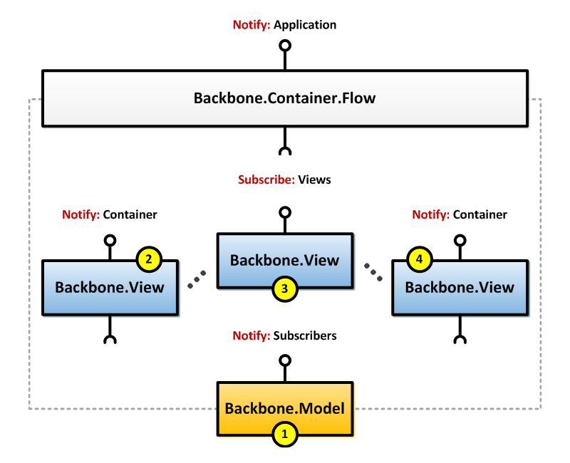

backbone.flow
=============

Specialized container for creating a workflow of views.

Prerequisites
-------------
* Node.js (v0.10.x)

Features
--------
* View Container
* Event Management
* Render Management
* Cleanup Management

Motivation
----------

While the general [recommendations](http://addyosmani.github.io/backbone-fundamentals/)
surrounding `Backbone.View` reuse are simply to trash views rather risk
[memory leaks](https://lostechies.com/derickbailey/2011/09/15/zombies-run-managing-page-transitions-in-backbone-apps/)
due to [complex event cleanup](http://ianstormtaylor.com/rendering-views-in-backbonejs-isnt-always-simple/),
there are some scenarios where _temporal_ reuse may prove useful.  For example,
consider the case of a user attempting to login via two-factor authentication,
performing a password reset, or placing an online order as part of a multi-step
process.  

Each of these scenarios represent a `Single Workflow Item`, whereby both
the application and the user need the ability to switch freely between these views
either by direct user interaction, or in the event of certain types of failures; not
to mention that each view may need to share access to the same models for state
and react to events.  

Architecture
------------

The principle behind the `Backbone.Container.Flow` is to act as a logical container
for the views, define the transitions between them, and manage event cleanup on your
behalf during transitions to prevent memory leaks. In essence, each child view should
not know that it is part of a container, and should still function as a standalone unit.  

Furthermore, the `Backbone.Container.Flow` expects child views to be injected
upon construction, with each of the shared models already injected into the
corresponding child views.  The diagram below helps to better illustrate these concepts:



Disclaimer
----------

When transitioning between views within a flow, the container will remove the DOM
event bindings but not `listenTo` bindings so that views can still react to model
events (if necessary).  This may lead to unintended consequences, as was described
in backbone [best practices](http://addyosmani.github.io/backbone-fundamentals/),
so use _responsibly_.  However, once `Backbone.Container.Flow.remove()` has been
explicitly called, all container and child view events will be cleaned up.

Usage and Documentation
-----------------------
Please ensure all dependencies have been installed prior to usage.

### Setup

Switch to the project root directory and run the `setup.sh` script (`setup.bat` for Windows):  
```bash
$ cd backbone.flow
$ ./bin/setup.sh
```

### Workflow

The `grunt serve` (watch, build, test) loop is designed to accelerate development workflow:
```bash
$ grunt serve
```

Alternatively, to simply build the component, invoke:
```bash
$ grunt build
```

Project Structure
-----------------
<pre>
/
|-- bower.json: runtime dependencies (backbone, underscore)
|-- package.json: build dependencies (grunt plugins)
|-- Gruntfile.js: all grunt build, deploy, compile, serve tasks
|-- dist: deployment-ready assets
|-- src: all component code
    |-- scripts (javascript assets)
        |-- backbone (backbone plugins)
            |-- container (container-based plugins)

</pre>

### Usage: Backbone
```javascript

// app namespace structure
var App = App || {};
App.Views = App.Views || {};
App.Models = App.Models || {};
App.Templates = App.Templates || {};

// define shared model
App.Models.SharedModel = Backbone.Model.extend({});

// define child views
App.Views.First = Backbone.View.extend({
  template: App.Templates['demo/first'],
  events: {
    'submit': 'update'
  },
  initialize: function (options) {
    this.listenTo(this.model, 'sync', this.success);
  },
  render: function () {
    this.$el.html(this.model.toJSON());
    this.hook.html(this.el);

    return this;
  },
  update: function (e) {
    this.model.save();
  },
  success: function () {
    this.trigger('demo:next');
  }
});

App.Views.Second = Backbone.View.extend({
  template: App.Templates['demo/second'],
  events: {
    'click a[href=#back]': 'back',
    'click a[href=#reload]': 'reload'
  },
  initialize: function (options) {
    this.hook = options.hook;
  },
  render: function () {
    this.$el.html(this.model.toJSON());
    this.hook.html(this.el);

    return this;
  },
  back: function () {
    this.trigger('demo:back');
  },
  reload: function () {
    this.trigger('demo:reload');
  }
});

// define flow view
Acid.Views.DemoFlow = Backbone.Container.Flow.extend({
  initialize: function (options) {
    options = options || {};
    this.vent = options.vent;
    this.views = options.views || this.views;

    // define view transitions by subscribing to events
    this.listenTo(this.views[0], 'demo:next', this.demoNext);
    this.listenTo(this.views[1], 'demo:back', this.demoBack);
    this.listenTo(this.views[1], 'demo:reload', this.demoReload);

    // set initial view
    this.next = this.views[0];
  },
  demoNext: function () {
    // set next view and call show (render and rebind events)
    this.next = this.views[1];
    this.show();
  },
  demoBack: function () {
    // set next view and call show (render and rebind events)
    this.next = this.views[0];
    this.show();
  },  
  demoReload: function () {
    // notify application to unload and reload the Demo Flow
    this.vent.trigger('demo:show');
  }
});

// create event bus to allow container to notify application of events
var vent = _.extend({}, Backbone.Events);

// instantiate model and child views
var model = new Acid.Models.SharedModel();
var first = new Acid.Views.First({model: model, hook: $('#main')});
var second = new Acid.Views.Second({model: model, hook: $('#main')})

// instantiate flow, inject child views and vent, and render the flow
var flow = new Acid.Views.DemoFlow({views: [first, second], vent: vent});
flow.render();

```

License
-------
Released under the MIT License.  See the LICENSE file for further details.
